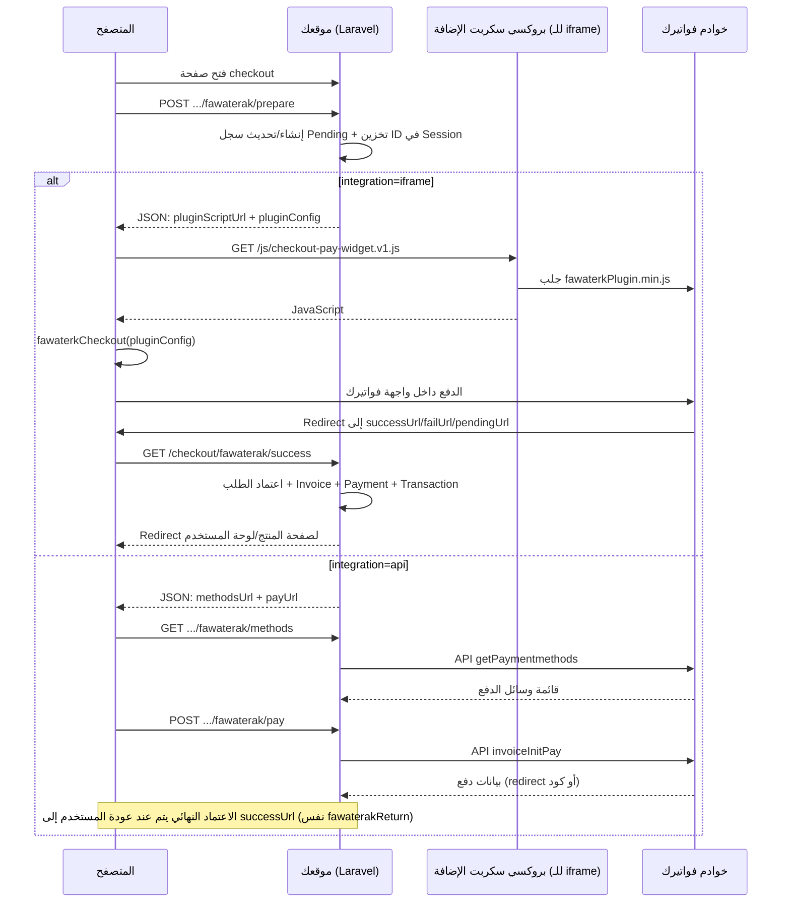

# دليل بوابة دفع «فواتيرك» (Fawaterak) — التوثيق الكامل للربط الحالي

هذا المستند يشرح **كل ما يخص بوابة الدفع فواتيرك في مشروع Muallimx**: الإعدادات، المسارات (Routes)، تدفق الدفع للكورسات والاشتراكات، وما الذي يُحفظ في الجلسة وقاعدة البيانات، وكيف يتم اعتماد الطلب وإنشاء الفاتورة محلياً بعد العودة من فواتيرك.

> ملاحظة أمنية: هذا المستند يشرح أسماء المتغيرات والحقول فقط، ولا يحتوي (ولا يجب أن يحتوي) أي قيم سرية من `.env`.

---

## جدول المحتويات

1. [ملخص سريع: ما الذي يحدث من البداية للنهاية؟](#1-ملخص-سريع-ما-الذي-يحدث-من-البداية-للنهاية)
2. [أنماط الربط المدعومة حالياً](#2-أنماط-الربط-المدعومة-حالياً)
3. [شروط تعمل قبل فواتيرك (جلسة/دومين/CSRF)](#3-شروط-تعمل-قبل-فواتيرك-جلسةدومينcsrf)
4. [تفعيل البوابة من لوحة الإدارة](#4-تفعيل-البوابة-من-لوحة-الإدارة)
5. [متغيرات `.env` — شرح كل ما يخص فواتيرك](#5-متغيرات-env--شرح-كل-ما-يخص-فواتيرك)
6. [الملفات والمسارات (Routes) في المشروع](#6-الملفات-والمسارات-routes-في-المشروع)
7. [تدفق شراء كورس عبر فواتيرك](#7-تدفق-شراء-كورس-عبر-فواتيرك)
8. [تدفق دفع اشتراك المعلم عبر فواتيرك](#8-تدفق-دفع-اشتراك-المعلم-عبر-فواتيرك)
9. [ماذا يُكتب في قاعدة البيانات عند النجاح؟](#9-ماذا-يكتب-في-قاعدة-البيانات-عند-النجاح)
10. [CSP + بروكسي سكربت الإضافة ولماذا موجود](#10-csp--بروكسي-سكربت-الإضافة-ولماذا-موجود)
11. [استكشاف الأخطاء الشائعة (عملي)](#11-استكشاف-الأخطاء-الشائعة-عملي)
12. [حدود الربط الحالي وملاحظات تطوير](#12-حدود-الربط-الحالي-وملاحظات-تطوير)

---

## 1. ملخص سريع: ما الذي يحدث من البداية للنهاية؟



**قاعدة ذهبية في الربط الحالي:** اعتماد الدفع وإنشاء الفاتورة المحلية وتفعيل الكورس/الاشتراك يتم عبر مسار العودة `GET /checkout/fawaterak/success` اعتماداً على session.

---

## 2. أنماط الربط المدعومة حالياً

القيمة في `config/fawaterak.php`:

- `FAWATERAK_INTEGRATION=iframe` (افتراضي): **إضافة فواتيرك + HMAC**.
- `FAWATERAK_INTEGRATION=api`: **Gateway API** عبر Bearer token (`getPaymentmethods` + `invoiceInitPay`).

كلا الوضعين مستخدم في الواجهات التالية:

- `resources/views/public/checkout.blade.php` (شراء كورس)
- `resources/views/public/subscription-checkout.blade.php` (اشتراك المعلم)

---

## 3. شروط تعمل قبل فواتيرك (جلسة/دومين/CSRF)

| الشرط | لماذا؟ |
|--------|--------|
| المستخدم **مسجّل دخول** | `prepare` و`return` يعتمدان على `Auth`. |
| للمستخدم **بريد إلكتروني صالح** في الملف الشخصي | `fawaterakPrepare` يرفض بدون بريد؛ فواتيرك تحتاج بيانات عميل. |
| الكورس **نشط** وسعره **أكبر من صفر** | لا يُجهَّز دفع بوابة لكورس مجاني أو معطّل. |
| **الجلسة (Session) تعمل** بعد العودة من فواتيرك | عند `success` يُقرأ `fawaterak_order_id` من الجلسة. إن ضاعت الجلسة (نطاق كوكي مختلف، `SameSite`، انتقال من دومين لآخر) لن يُفعَّل الطلب تلقائياً رغم نجاح الدفع لدى فواتيرك. |
| `APP_URL` يطابق **الرابط الذي يفتحه المستخدم** قدر الإمكان | يؤثر على الروابط المُولَّدة لـ `successUrl` وغيرها، وعلى استنتاج النطاق للـ HMAC إن لم تضبط `FAWATERAK_IFRAME_DOMAIN`. |

بعد أي تعديل على `.env` شغّل:

```bash
php artisan config:clear
```

---

## 3. تفعيل البوابة من لوحة الإدارة

- المفتاح في قاعدة البيانات: `fawaterak_gateway_enabled` = `1` (يُقرأ عبر `PaymentGatewaySettings`).
- من **إعدادات النظام** في لوحة الأدمن: تفعيل خيار بوابة فواتيرك.

**إن كانت مفعّلة لكن المفاتيح ناقصة:** الصفحة قد تعرض تنبيهاً أن الإعداد غير مكتمل (`fawaterakMisconfigured`).

**عند التفعيل:** مسار إتمام شراء **الكورس** يمنع الدفع اليدوي برفع إيصال (`CheckoutController::complete`).

---

## 4. إعداد لوحة فواتيرك (التاجر)

1. **تفعيل الحساب:** تأكد أن حساب التاجر **نشط** وليس معلّقاً؛ رسالة **"inactive vendor"** تأتي من فواتيرك عندما الحساب غير جاهز للاستقبال.
2. **بيئة واحدة واضحة:** إن كنت تختبر، استخدم مفاتيح **Staging/Test** مع `FAWATERAK_ENV=test`. مفاتيح **Live** مع `test` (أو العكس) تسبب **Invalid Token** أو رفض الطلبات.
3. **تكامل Fawaterak / iframe:** انسخ من لوحة فواتيرك (حسب تسميتهم):
   - ما يُسمّى غالباً **API Key / Vendor Key** (يُستخدم عندنا كجزء من الـ HMAC وقد يُستخدم كـ `token` للإضافة).
   - **Provider Key** (يُدخل في الـ HMAC مع النطاق).
4. **النطاق (Domain) في لوحة فواتيرك:** يجب أن يطابق **نفس النطاق** الذي تُحسب منه قيمة الـ HMAC في السيرفر (انظر القسم 6). مثال شائع: لوحة فواتيرك مسجّلة على `https://example.com` بينما تطور على `http://127.0.0.1` — قد تحتاج نطاق تجريبي مسجّل لديهم أو ضبطاً يدوياً لـ `FAWATERAK_IFRAME_DOMAIN` ليطابق **ما أدخلته في لوحة فواتيرك** وليس بالضرورة ما في المتصفح إذا اختلف التصميم.
5. **Bearer منفصل (إن وُجد):** بعض لوحات فواتيرك تعطي **رمز Bearer** لطلبات الإضافة يختلف عن مفتاح الـ Vendor؛ عندها استخدم `FAWATERAK_PLUGIN_BEARER_TOKEN` (انظر القسم 5).

---

## 5. متغيرات `.env` — شرح كل حقل وأخطاء شائعة

| المتغير | مطلوب؟ | الشرح التفصيلي |
|---------|--------|----------------|
| `FAWATERAK_INTEGRATION` | نعم للتوثيق | ضع **`iframe`**. أي قيمة أخرى تفعّل مسار API في الكود وتغيّر استجابة `prepare`. |
| `FAWATERAK_ENV` | نعم | **`test`** أو **`live`**. يحدد عنوان سكربت الإضافة الافتراضي وبيئة فواتيرك. يجب أن يطابق نوع المفاتيح التي نسختها من لوحة فواتيرك. |
| `FAWATERAK_VENDOR_KEY` | نعم (iframe) | المفتاح السري المستخدم في `hash_hmac` مع `Provider Key` والنطاق. **لا تلصق مسافات** قبل/بعد القيمة. |
| `FAWATERAK_PROVIDER_KEY` | نعم (iframe) | الجزء العلني في سلسلة الـ HMAC. خطأ حرف واحد = فشل التحقق لدى فواتيرك. |
| `FAWATERAK_IFRAME_DOMAIN` | اختياري | إن كان فارغاً: يُشتق من `APP_URL` كـ `https://` + اسم المضيف فقط (بدون مسار). **استخدمه** إذا: (أ) لوحة فواتيرك مضبوطة على نطاق محدد و`APP_URL` لا يطابقه، (ب) `www` مقابل بدون `www`، (ج) تطوير محلي وتريد أن يطابق الـ HMAC ما سجّلته عندهم. |
| `FAWATERAK_PLUGIN_BEARER_TOKEN` | اختياري | إن وُجد: يُمرَّر كحقل **`token`** في `pluginConfig` للإضافة. إن كان فارغاً: يُستخدم **`FAWATERAK_VENDOR_KEY`** كـ `token`. **خطأ شائع:** وضع Provider Key هنا أو العكس — ينتج **Invalid Token**. |
| `FAWATERAK_CURRENCY` | اختياري | افتراضي `EGP`. يجب أن تكون العملة متوافقة مع إعدادات فواتيرك. |
| `FAWATERAK_VERSION` | اختياري | يُرسل للإضافة إن كان غير `0`؛ اتبع وثائق فواتيرك إن طلبوا إصداراً محدداً. |
| `FAWATERAK_TEST_PLUGIN_URL` / `FAWATERAK_LIVE_PLUGIN_URL` | اختياري | لتجاوز رابط السكربت الافتراضي (مثلاً إن غيّرت فواتيرك عنوان الملف). |
| `APP_URL` | مهم جداً | يُفضّل **https** على الإنتاج. على التطوير: إن استخدمت `http://127.0.0.1:8000` فـ `domainForHash()` بدون `FAWATERAK_IFRAME_DOMAIN` يصبح `https://127.0.0.1` — قد **لا يطابق** ما يرسله المتصفح أو ما في لوحة فواتيرك؛ راجع القسم 11. |

**لا ترفع ملف `.env` لأي مستودع.** بعد التعديل: `php artisan config:clear`.

---

## 6. المفاتيح الثلاثة: Vendor و Provider و Token (ولماذا تظهر Invalid Token)

### 6.1 ما الذي يحسبه السيرفر؟

في `App\Services\FawaterakService::generateHashKey()`:

- تُبنى سلسلة بالشكل: `Domain=<النطاق>&ProviderKey=<provider_key>`.
- يُحسب `hash_hmac('sha256', ..., vendor_key)`.
- **النطاق** من `FAWATERAK_IFRAME_DOMAIN` أو من `https://` + host من `APP_URL`.

هذا الـ **`hashKey`** يُرسل للإضافة مع **`token`** في JSON الـ `prepare`.

### 6.2 ما هو `token` في `pluginConfig`؟

في `CheckoutController::fawaterakPrepare`:

1. إن وُجد `FAWATERAK_PLUGIN_BEARER_TOKEN` → يُستخدم كـ **`token`**.
2. وإلا → يُستخدم **`FAWATERAK_VENDOR_KEY`** كـ **`token`**.

فواتيرك تتحقق من هذا الرمز على خوادمها؛ لذلك:

- **"Invalid Token"** = الرمز المرسل لا يقبله حسابك في **نفس البيئة** (test/live)، أو نسخت مفتاحاً خاطئاً، أو تخليط بين أنواع المفاتيح.
- **"inactive vendor"** = الحساب عند فواتيرك غير مفعّل للتجارة/الربط — لا يُصلحه تغيير الكود.

### 6.3 علاقة الـ HMAC بالـ Token

يمكن أن يكون الـ **HMAC صحيحاً** بينما **الـ token** رفضته الـ API (أو العكس). عالج الاثنين بشكل مستقل: انسخ من لوحة فواتيرك حسب أقسامهم (Vendor / Provider / Bearer إن وُجد).

---

## 7. الملفات والمسارات في المشروع

| الملف | الدور |
|-------|--------|
| `config/fawaterak.php` | ربط كل متغيرات البيئة بالإعدادات. |
| `app/Services/FawaterakService.php` | `domainForHash()`, `generateHashKey()`, `pluginScriptUrl()`, `isConfigured()`. |
| `app/Http/Controllers/Public/CheckoutController.php` | `show`, `fawaterakPrepare`, `fawaterakReturn`, `approveOrderAfterOnlinePayment`. |
| `app/Http/Controllers/Public/FawaterkPluginController.php` | بروكسي السكربت + كاش ~6 ساعات. |
| `routes/web.php` | تعريف المسارات العامة لـ prepare و return والبروكسي. |
| `resources/views/public/checkout.blade.php` | جافاسكربت iframe: `fetch(prepare)` ثم تحميل السكربت ثم `fawaterkCheckout`. |
| `app/Http/Middleware/SecurityHeadersMiddleware.php` | إضافة نطاقات فواتيرك إلى CSP عند تفعيل CSP. |
| `app/Services/PaymentGatewaySettings.php` | قراءة تفعيل البوابة من جدول `settings`. |

### مسارات HTTP (iframe)

| الطريقة | المسار | ملاحظة |
|---------|--------|--------|
| POST | `/course/{id}/checkout/fawaterak/prepare` | يحتاج جلسة مسجّل + CSRF (الواجهة ترسل `X-CSRF-TOKEN`). |
| GET | `/checkout/fawaterak/{status}` | `success` / `fail` / `pending` — روابط تُولَّد داخل `pluginConfig`. |
| GET | `/js/checkout-pay-widget.v1.js` | البروكسي؛ يجب أن يكون قابلاً للوصول بنفس النطاق. |

---

## 8. تدفق `fawaterakPrepare` والعودة `fawaterakReturn`

### 8.1 `fawaterakPrepare` — شروط الرفض الشائعة

| رمز / حالة | السبب |
|------------|--------|
| 403 | البوابة معطّلة من الإدارة. |
| 503 | iframe غير مهيأ (ناقص Vendor أو Provider) أو وضع غير iframe مع نقص API. |
| 401 | غير مسجّل دخول. |
| 404 | كورس غير موجود أو غير مفعّل. |
| 422 | مسجّل مسبقاً في الكورس، أو سعر صفر، أو **بريد غير صالح**، أو طلب غير مناسب لإعادة الدفع. |
| 409 | طلب معلّق آخر لنفس الكورس ليس من نوع «أونلاين بلا إيصال». |

عند النجاح: يُخزَّن في الجلسة **`fawaterak_order_id`** = معرف سجل `orders`.

### 8.2 `fawaterakReturn`

- يقرأ `fawaterak_order_id` من الجلسة.
- **`fail`:** يُفرغ المفتاح ويُعاد للـ checkout برسالة فشل.
- **`pending`:** رسالة انتظار؛ لا يُنشأ فاتورة محلية بعد.
- **`success`:** قفل الصف + إن الطلب لا يزال `pending` → `approveOrderAfterOnlinePayment`: إنشاء `Invoice`, `Payment`, `Transaction`, قبول `Order`, تفعيل التسجيل في الكورس.

**مهم:** إن انتهت الجلسة قبل الوصول إلى `success`، قد ترى رسالة عن انتهاء جلسة الدفع؛ الدفع قد يكون ناجحاً عند فواتيرك لكن المنصة لم تربطه — يحتاج تدخل يدوي أو تحسين لاحق (Webhook).

---

## 9. الواجهة الأمامية: تحميل السكربت و`pluginConfig`

في `checkout.blade.php` (فرع iframe):

1. **POST** إلى `prepareUrl` مع `X-CSRF-TOKEN` و`credentials: 'same-origin'`.
2. الاستجابة يجب أن تحتوي `mode: iframe`, `pluginScriptUrl`, `pluginConfig`.
3. يُحمَّل السكربت من `pluginScriptUrl` (عادة بروكسي الموقع). عند الفشل يُجرّب تحميل عبر **Blob** كاحتياطي.
4. يُعيَّن **`window.pluginConfig = cfg`** ثم يُستدعى **`fawaterkCheckout(cfg)`** — مطلوب من سكربت فواتيرك.

أخطاء الواجهة الشائعة:

- **419:** انتهاء CSRF — حدّث الصفحة بالكامل.
- **401 / HTML بدل JSON:** انتهت جلسة تسجيل الدخول.
- **`no_fn`:** السكربت وصل لكن `fawaterkCheckout` غير معرّف — غالباً CSP أو محتوى ليس JavaScript (راجع البروكسي وسجلات 502).

---

## 10. CSP (Content-Security-Policy) وتعطيله محلياً

في `SecurityHeadersMiddleware`:

- إذا **`APP_DEBUG=true`** و **`DISABLE_CSP=true`** (الافتراضي في الكود: `env('DISABLE_CSP', true)`): **لا تُطبَّق CSP** على الاستجابة — يسهّل التطوير المحلي.
- إذا **`APP_DEBUG=false`** أو **`DISABLE_CSP=false`**: تُضاف CSP وتُسمح فيها نطاقات فواتيرك (`app.fawaterk.com`, `staging.fawaterk.com`, إلخ) لـ `script-src`, `frame-src`, `form-action`.

**إن فشل الدفع على الإنتاج فقط:** راجع أن CSP لا تحجب نطاقاً جديداً استخدمته فواتيرك. **إن فشل محلياً مع debug:** جرّب تعطيل إضافات الحجب أو فتح Console.

---

## 11. استكشاف الأخطاء — جدول الأعراض والحلول

| ما تراه | الخطوات المقترحة (بالترتيب) |
|---------|------------------------------|
| تنبيه **Invalid Token or inactive vendor** | (1) تحقق تفعيل التاجر في لوحة فواتيرك. (2) طابق **test/live** مع المفاتيح. (3) جرّب **`FAWATERAK_PLUGIN_BEARER_TOKEN`** إن وفروا Bearer منفصلاً عن Vendor. (4) أعد نسخ Vendor/Provider من لوحة فواتيرك دون مسافات. |
| صفحة الدفع لا تظهر واجهة فواتيرك | (1) فعّل البوابة من الإدارة. (2) `FAWATERAK_VENDOR_KEY` + `FAWATERAK_PROVIDER_KEY`. (3) `FAWATERAK_INTEGRATION=iframe`. (4) `php artisan config:clear`. |
| رسالة «غير مهيأة» رغم وجود المفاتيح | تحقق أن القيم فعلاً تُقرأ (لا تعليق `#` خاطئ في `.env`)، وأنك لست في وضع `api` بلا `FAWATERAK_API_TOKEN`. |
| **fawaterkCheckout** غير معرّف | افتح `/js/checkout-pay-widget.v1.js` في المتصفح — هل يعيد JS أم خطأ؟ راجع `storage/logs/laravel.log` لبروكسي فواتيرك. راجع CSP على الإنتاج. |
| **انتهت جلسة الدفع** بعد نجاح الدفع | Cookie domain / `SameSite` / الانتقال من www لغير www؛ ثبّت نطاقاً واحداً؛ على الإنتاج استخدم HTTPS و`SESSION_DOMAIN` المناسب. |
| **422** من prepare: بريد | أضف بريداً صالحاً لحساب الطالب. |
| **HMAC / رفض من فواتيرك بدون رسالة واضحة** | ضبط **`FAWATERAK_IFRAME_DOMAIN`** ليطابق **بالضبط** قيمة Domain المسجّلة في لوحة فواتيرك (غالباً `https://النطاق` بدون `/` أخيرة). |
| الكورس لا يُفعّل رغم نجاح الدفع | راجع الجلسة؛ راجع `storage/logs/laravel.log` عند `Fawaterak return: approval failed`؛ تحقق أن الطلب ما زال `pending` وليس مكرراً. |

### أدوات تشخيص سريعة

- **Network:** طلب `prepare` — الحالة 200؟ الجسم JSON؟
- **Console:** أخطاء تحميل السكربت أو CSP.
- **`php artisan config:show fawaterak`** (إن متوفراً في إصدار لارافيل) أو مؤقتاً `dd(config('fawaterak'))` في بيئة تطوير فقط للتحقق من القراءة (لا تترك `dd` على الإنتاج).

---

## 12. حدود التكامل الحالي

- الدفع عبر فواتيرك (iframe) مربوط بمسار **شراء الكورس** من `CheckoutController::show` للكورس. **صفحة checkout المسار التعليمي** (`showLearningPath`) تضع `fawaterakUseGateway = false` — لا يظهر فيها نفس ويدجت فواتيرك في التدفق الحالي.
- **كاشير** معطّل في المسارات العامة الحالية.
- الاعتماد على **عودة المتصفح + الجلسة** لإتمام الفاتورة المحلية؛ لا يُوثَّق هنا Webhook من فواتيرك (يمكن إضافته لاحقاً لزيادة الموثوقية).

---

## ملخص تحقق سريع (Checklist)

- [ ] `FAWATERAK_INTEGRATION=iframe`
- [ ] `FAWATERAK_ENV` يطابق نوع المفاتيح (test/live)
- [ ] `FAWATERAK_VENDOR_KEY` و `FAWATERAK_PROVIDER_KEY` مضبوطان بدون مسافات زائدة
- [ ] إن لزم: `FAWATERAK_PLUGIN_BEARER_TOKEN` من لوحة فواتيرك
- [ ] إن لزم: `FAWATERAK_IFRAME_DOMAIN` يطابق لوحة فواتيرك
- [ ] `APP_URL` منطقي للبيئة الحالية
- [ ] تفعيل البوابة من إعدادات النظام
- [ ] المستخدم له بريد صالح
- [ ] `php artisan config:clear` بعد تعديل `.env`

---

*آخر تحديث: نيسان 2026 — وضع iframe فقط.*
